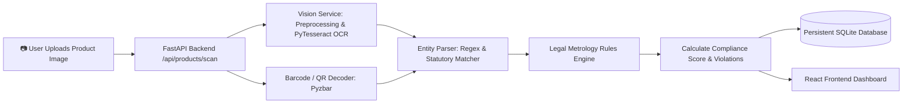

# 🔍 LM-Vision — AI-Powered Legal Metrology Compliance System

> **Smart India Hackathon (SIH 2026)**  
> *Automated label verification, OCR extraction, and statutory compliance checking under the **Legal Metrology (Packaged Commodities) Rules, 2011**.*

---

[](https://fastapi.tiangolo.com/)
[](https://react.dev/)
[](https://python.org)
[](https://sqlite.org/)
[](https://www.docker.com/)

---

## 📖 Table of Contents

- [💡 What is LM-Vision? (In Simple Words)](#-what-is-lm-vision-in-simple-words)
- [✨ Key Features](#-key-features)
- [🏗️ How It Works (System Architecture)](#️-how-it-works-system-architecture)
- [🚀 Quick Start (Easiest Way for Beginners)](#-quick-start-easiest-way-for-beginners)
  - [Prerequisites](#1-prerequisites)
  - [Option A: One-Click Startup (Windows)](#option-a-one-click-startup-windows)
  - [Option B: Manual Startup (Step-by-Step)](#option-b-manual-startup-step-by-step)
  - [Option C: Docker Setup](#option-c-docker-setup)
- [🔑 Demo Login Credentials](#-demo-login-credentials)
- [📁 Folder Structure Explained](#-folder-structure-explained)
- [📜 Legal Metrology Rules Checked](#-legal-metrology-rules-checked)
- [📡 API Documentation](#-api-documentation)
- [❓ Troubleshooting & FAQs](#-troubleshooting--faqs)
- [👥 Authors & Acknowledgments](#-authors--acknowledgments)

---

## 💡 What is LM-Vision? (In Simple Words)

When you buy any packaged product (like chips, soap, milk, or medicine), Indian law requires manufacturers to print important details clearly on the package:
- **MRP** (Maximum Retail Price)
- **Net Quantity / Weight** (e.g., `500g`, `1L`)
- **Unit Sale Price (USP)** (e.g., `₹0.50 per gram` so buyers can compare prices fairly)
- **Manufacturing & Expiry Dates**
- **Consumer Care Details** (Phone, email, and address for complaints)
- **FSSAI License Number & Logo** (for food products)
- **Country of Origin & Manufacturer Address**

### The Problem:
Inspectors currently have to verify these rules **manually** by reading tiny fonts on thousands of products, which is slow and prone to errors. Some brands hide prices, miscalculate unit prices, or omit mandatory details.

### The Solution:
**LM-Vision** is an intelligent web platform that allows **Field Inspectors** and **Regulatory Authorities** to take or upload a photo of any product package. The system uses **Computer Vision & AI** to:
1. Scan and read the text from the package image (**OCR**).
2. Decode barcodes and QR codes.
3. Automatically check all statutory rules from the **Legal Metrology (Packaged Commodities) Rules, 2011**.
4. Recalculate and verify mathematical values (such as Unit Sale Price = MRP ÷ Net Weight).
5. Generate an instant **Compliance Score (0–100%)**, highlight violations with visual boxes, and create downloadable legal inspection reports.

---

## ✨ Key Features

### 🏢 1. Regulatory Authority Portal
- **Real-Time Analytics Dashboard**: Visual graphs of overall market compliance, violation severity breakdowns, and category trends.
- **Inspection Management**: Assign inspection tasks to specific field inspectors.
- **Consumer Grievance Redressal**: View, prioritize, and assign citizen complaints.
- **Dynamic Rule Engine & Amendments**: Create or amend statutory rules as new government gazettes are published.

### 🕵️ 2. Field Inspector Portal
- **AI Product Scanner**: Upload or capture packaging photos for automated parsing.
- **Visual Bounding Boxes**: Highlights detected label fields (MRP, Net Weight, Dates, FSSAI, etc.) directly on the uploaded image.
- **Live Rule Verification**: Instant pass/fail status with severity ratings (*Critical, High, Medium, Low*).
- **Inspection Checklist & Evidence Upload**: Attach photos and submit official on-field inspection reports.
- **PDF Report Generation**: Download branded, tamper-evident inspection reports.

### 🧠 3. Smart Compliance Engine
- **Unit Sale Price (USP) Validator**: Verifies mandatory declaration for items over 1kg/1L and checks whether calculated USP matches the declared USP.
- **Date & Expiry Engine**: Detects missing, expired, or non-compliant date formats.
- **Logo & Symbol Recognition**: Verifies FSSAI logos and Vegetarian/Non-Vegetarian green/brown dot symbols.
- **Barcode & QR Decoding**: Cross-references physical product barcodes with stored database entries.

---

## 🏗️ How It Works (System Architecture)



---

## 🚀 Quick Start (Easiest Way for Beginners)

Follow these simple steps to run the complete project on your computer!

### 1. Prerequisites

Make sure you have the following free tools installed:
- **[Git](https://git-scm.com/downloads)** (To download the code)
- **[Python 3.10 or higher](https://www.python.org/downloads/)** (Be sure to check *"Add Python to PATH"* during installation!)
- **[Node.js 18 or higher](https://nodejs.org/)** (Includes `npm`)
- *(Optional)* **[Tesseract OCR](https://github.com/UB-Mannheim/tesseract/wiki)** (For local OCR text recognition on images)

---

### Option A: One-Click Startup (Windows)

If you are on Windows, we have created an automated launcher for you!

1. Open the project folder in Terminal or File Explorer.
2. Double-click **`start_services.bat`**.
3. It will automatically:
   - Start the **FastAPI Backend** on `http://localhost:5000`
   - Start the **React Frontend** on `http://localhost:3000`
4. Open your browser and navigate to **`http://localhost:3000`**! 🎉

---

### Option B: Manual Startup (Step-by-Step)

If you prefer running it manually or you are on **macOS/Linux**:

#### Step 1: Clone the repository
```bash
git clone https://github.com/matzcoder/SIH2026.git
cd SIH2026
```

#### Step 2: Start the Backend (Terminal 1)
```bash
# 1. Navigate to the Backend folder
cd Backend

# 2. Install required Python packages
pip install -r requirements.txt

# 3. Start the FastAPI server
python -m uvicorn main:app --reload --host 0.0.0.0 --port 5000
```
> 💡 *The backend is now running at `http://localhost:5000`.*  
> 💡 *View interactive API documentation at `http://localhost:5000/docs`.*

#### Step 3: Start the Frontend (Terminal 2)
```bash
# Open a NEW terminal window/tab
# 1. Navigate to the frontend folder
cd sih-project

# 2. Install dependencies
npm install

# 3. Start the React development server
npm start
```
> 💡 *The frontend web app will open automatically at `http://localhost:3000`.*

---

### Option C: Docker Setup

If you have **Docker Desktop** installed, you can launch the entire stack with one command:

```bash
docker compose up --build
```
- Frontend: `http://localhost:3000`
- Backend API: `http://localhost:5000`

---

## 🔑 Demo Login Credentials

The database automatically comes pre-seeded with demo accounts so you can test immediately:

| Portal Role | Email Address | Password | Permissions |
| :--- | :--- | :--- | :--- |
| 👑 **Regulatory Authority** | `admin@example.com` | `Admin@123` | Full dashboard access, assigning inspections, rule amendments, analytics |
| 🕵️‍♂️ **Field Inspector** | `inspector@example.com` | `Inspector@123` | Image OCR scanning, compliance verification, submitting field reports |

---

## 📁 Folder Structure Explained

Here is a simplified overview of how the codebase is organized:

```text
SIH2026/
├── Backend/                        # Python FastAPI Backend
│   ├── main.py                     # Main server entrypoint & API routes
│   ├── database.py                 # SQLite database connection & setup
│   ├── config.py                   # Environment settings & secrets
│   ├── compliance.db               # Persistent SQLite database file
│   ├── requirements.txt            # Python dependencies list
│   ├── models/
│   │   ├── db_models.py            # Database tables (Users, Products, Inspections, etc.)
│   │   └── schemas.py              # Data structures & validation schemas
│   ├── routes/
│   │   ├── auth.py                 # Login, registration, token verification
│   │   ├── products.py             # Product scanning, search, OCR analysis
│   │   ├── inspections.py          # Field inspections, evidence upload, reports
│   │   ├── complaints.py           # Consumer grievance filing & tracking
│   │   └── rules.py                # Statutory rules & amendments API
│   └── services/
│       ├── parser.py               # Regex parsing of label entities (MRP, Net Wt, etc.)
│       ├── rules.py                # Legal Metrology rule engine & scoring logic
│       ├── vision.py               # Image processing, OCR extraction & barcode decoding
│       └── seed_data.py            # Initial database demo data seeder
│
├── sih-project/                    # React Frontend UI
│   ├── public/                     # Static HTML & public assets
│   ├── src/
│   │   ├── App.js                  # Main React application & routing
│   │   ├── components/             # Reusable UI components (Navbars, Cards, Modals)
│   │   ├── pages/
│   │   │   ├── AuthorityPortal.jsx # Authority dashboard, graphs, management
│   │   │   └── InspectorPortal.jsx # Inspector scanner, camera, live verification
│   │   └── services/               # API client functions (Axios calls to backend)
│   └── package.json                # Frontend dependencies and npm scripts
│
├── sample_data/                    # Sample product images for testing OCR scanning
├── start_services.bat              # One-click Windows startup script
├── docker-compose.yml              # Docker multi-container orchestrator
└── README.md                       # Project documentation (You are here!)
```

---

## 📜 Legal Metrology Rules Checked

LM-Vision evaluates packaged commodities against mandatory provisions under the **Legal Metrology (Packaged Commodities) Rules, 2011 (India)**:

| Rule Code | Mandatory Declaration | Description & Validation | Severity |
| :--- | :--- | :--- | :--- |
| **LM-R01** | **Maximum Retail Price (MRP)** | Must declare retail price inclusive of all taxes (`Rs. XX.XX` or `MRP incl. of all taxes`). | `CRITICAL` |
| **LM-R02** | **Net Quantity / Weight** | Must declare net quantity in standard metric units (g, kg, ml, L). | `CRITICAL` |
| **LM-R03** | **Unit Sale Price (USP)** | Required if net quantity > 1kg/1L. Must match `MRP ÷ Net Quantity`. | `HIGH` |
| **LM-R04** | **Date of Manufacture / Expiry** | Must declare month & year of manufacturing / best before date. | `HIGH` |
| **LM-R05** | **Manufacturer / Packer Details** | Name and complete physical address of manufacturer/packer must be present. | `MEDIUM` |
| **LM-R06** | **Consumer Care Contact** | Name, telephone number, email, and address for consumer complaints. | `MEDIUM` |
| **LM-R07** | **Country of Origin** | Mandatory declaration of country of origin (e.g., *Made in India*). | `LOW` |
| **LM-R08** | **FSSAI License & Logo** | 14-digit FSSAI registration number and logo for edible items. | `HIGH` |
| **LM-R09** | **Veg / Non-Veg Symbol** | Green dot for vegetarian products or brown dot for non-vegetarian products. | `MEDIUM` |

---

## 📡 API Documentation

FastAPI provides automatic interactive Swagger documentation. When your backend is running, visit:

- 📖 **Interactive Swagger UI**: [http://localhost:5000/docs](http://localhost:5000/docs)
- 📑 **ReDoc Documentation**: [http://localhost:5000/redoc](http://localhost:5000/redoc)

### Key API Endpoints:

| Method | Endpoint | Description |
| :--- | :--- | :--- |
| `POST` | `/api/auth/login` | Login and receive JWT authentication token |
| `POST` | `/api/products/scan` | Upload product image for OCR & rule evaluation |
| `GET` | `/api/products/history` | Retrieve list of all previously scanned products |
| `GET` | `/api/products/{id}/compliance` | Get detailed compliance score and violation breakdown |
| `GET` | `/api/inspections/my-assignments`| Get assigned inspections for logged-in inspector |
| `POST` | `/api/inspections/{id}/submit` | Submit on-field inspection result |
| `GET` | `/api/inspections/{id}/report` | Download official PDF inspection report |
| `GET` | `/api/rules/active` | Get active statutory rules and thresholds |

---

## ❓ Troubleshooting & FAQs

<details>
<summary><b>Q1: Port 5000 or Port 3000 is already in use?</b></summary>

- **Backend**: You can run it on another port:
  ```bash
  python -m uvicorn main:app --reload --port 5001
  ```
- **Frontend**: If port 3000 is busy, React will automatically ask if you want to run on another port (type `Y` for yes).
</details>

<details>
<summary><b>Q2: "Tesseract not found" error during image scanning?</b></summary>

- Make sure you install **Tesseract OCR**:
  - **Windows**: Download from [UB-Mannheim Tesseract Wiki](https://github.com/UB-Mannheim/tesseract/wiki) and install to default location (`C:\Program Files\Tesseract-OCR`).
  - **macOS**: `brew install tesseract`
  - **Linux (Ubuntu/Debian)**: `sudo apt-get install tesseract-ocr`
</details>

<details>
<summary><b>Q3: How to test without camera or physical products?</b></summary>

- Use the sample test images provided in the `sample_data/` folder! You can simply drag and drop them into the inspector scan interface.
</details>

<details>
<summary><b>Q4: How do I reset the database to fresh sample data?</b></summary>

- Stop the backend server, delete the file `Backend/compliance.db`, and restart the backend. The server will automatically recreate and re-seed fresh demo data!
</details>

---

## 👥 Authors & Acknowledgments

- **Developed for Smart India Hackathon (SIH 2026)**
- Built with ❤️ by **Team LM-Vision**

---

<p align="center">
  ⭐ If you found this project helpful, please consider giving it a star on GitHub! ⭐
</p>
